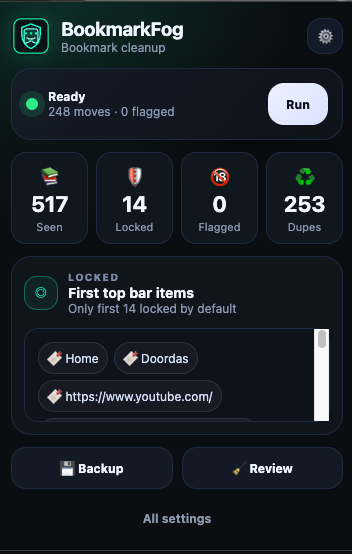

# BookmarkFog

BookmarkFog is a local Chrome extension for organizing bookmarks safely.

It is built to protect the visible bookmarks bar by default. The top bar under the URL field is locked, including folders on that bar. BookmarkFog only works on bookmarks behind the menus unless you turn that protection off in settings.

## Screenshot

## Features

- Local bookmark scan using Chrome's bookmarks API
- Top bookmarks bar protection enabled by default
- Folder suggestions by category
- Review screen before moving anything
- NSFW bookmark detection and quarantine
- Duplicate URL detection
- Empty folder cleanup
- JSON backup export
- HTML backup export for Chrome Bookmark Manager fallback
- Safe JSON restore into a new restore folder, not over your current bookmarks
- Undo last move batch
- No server, no account, no cloud sync

## Install in Chrome

1. Download and unzip `BookmarkFog.zip`.
2. Open `chrome://extensions`.
3. Turn on `Developer mode`.
4. Click `Load unpacked`.
5. Select the unzipped `BookmarkFog` folder.
6. Click the BookmarkFog icon, then click `Run` or `Review`.

## Safe workflow

1. Click `Backup` first.
2. Run scan.
3. Review suggested folders.
4. Use `Move selected` for safe category moves.
5. Use `Quarantine selected` for NSFW or duplicate cleanup.
6. Only permanently delete after checking the quarantine folder.

## Important behavior

BookmarkFog does not auto delete anything. NSFW cleanup moves bookmarks into `BookmarkFog Quarantine` unless you use the permanent delete button and confirm it.

JSON restore is intentionally non destructive. It recreates a backup inside `Other Bookmarks / BookmarkFog Restored / ...` instead of overwriting your current bookmarks.
